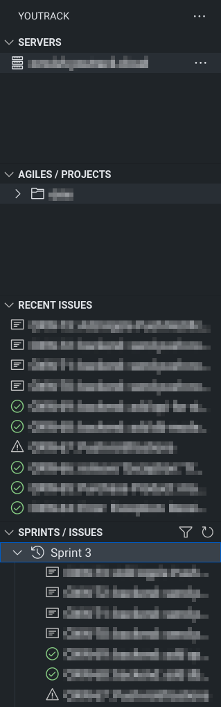

# YouTrack Extension for Visual Studio Code


This extension provides basic integration between [YouTrack](https://www.jetbrains.com/youtrack/) and VS Code. It allows you to browse your agiles and issues, quickly create or checkout git branches and update issue information. This is an unofficial extension and not affiliated with [JetBrains](#copyright-attributions).



## Installation

The extension is available in [Visual Studio Marketplace](https://marketplace.visualstudio.com/items?itemName=maximtrp.youtrack-ext) and [Open VSX](https://open-vsx.org/extension/maximtrp/youtrack-ext).
To use this extension, you should create a [personal access token](https://www.jetbrains.com/help/youtrack/standalone/Manage-Permanent-Token.html#obtain-permanent-token) (usually prefixed with `perm`).

## Features

* Support for multiple YouTrack servers
* Listing all agiles and projects
* Grouping, sorting and filtering issues by many criteria (see screenshot above)
* Updating issue state, priority or type
* Creating or checking out a branch for an issue

## Web Extension

To use this extension in a web environment ([VS Code for Web](https://vscode.dev/)), you must set CORS parameters using [this API](https://www.jetbrains.com/help/youtrack/devportal/resource-api-admin-globalSettings-restSettings.html).

For example, you can make a similar request using [REST Client](https://marketplace.visualstudio.com/items?itemName=humao.rest-client):

```
@SERVER = https://your.youtrack.domain
@TOKEN = perm:...

POST {{SERVER}}/api/admin/globalSettings/restSettings
Authorization: Bearer {{TOKEN}}
Content-Type: application/json

{
  "allowedOrigins": "https://vscode.dev"
}
```

## Copyright attributions

Copyright © 2023 JetBrains s.r.o. [YouTrack](https://www.jetbrains.com/youtrack/) and the YouTrack logo are registered trademarks of [JetBrains s.r.o](https://www.jetbrains.com).
